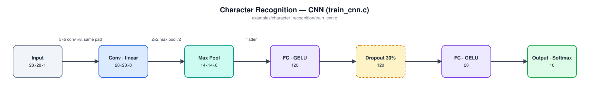
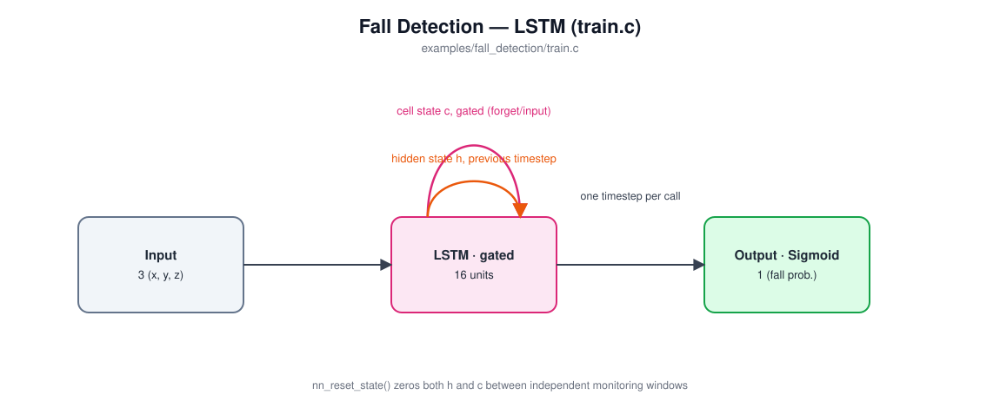

# Examples

Three self-contained examples of constructing, training, and evaluating a network with this library. Each has its own Makefile (`cd examples/<name> && make`, recursing into the top-level Makefile for the shared library), its own README (embedded-system framing, architecture diagram, build/run instructions, sample output), and generates or synthesizes its own training data -- nothing here needs to be built from the repository root.

Read in order, they also tell a story: each example needs a little more memory than the last to solve its task, and the layer type it reaches for tracks that escalation directly.

| Example | Layer type | Task | Parameters |
|---|---|---|---|
| [`character_recognition`](character_recognition/README.md) | CNN *vs.* plain FC (both included, for comparison) | Classify a whole 28×28 image at once -- no memory of anything needed | ~191K (CNN) / ~109K (FC) |
| [`gesture_recognition`](gesture_recognition/README.md) | RNN | Classify a short (32-timestep) burst of sensor readings -- needs to remember the last second or so | 388 |
| [`fall_detection`](fall_detection/README.md) | LSTM | Continuously monitor a long (150-timestep) stream and flag a rare event -- needs to remember something brief that happened many steps ago, selectively, without it decaying | 1,297 |

## [`character_recognition`](character_recognition/README.md)

 

Recognizes handwritten digits (MNIST) -- the "hello world" of embedded computer vision, and the network behind this library's own STM32H7 hardware demo (see the top-level README). Trains **two** architectures on identical data -- `train_cnn.c` (convolution + pooling ahead of the fully-connected layers) and `train_fc.c` (a plain FC network, no convolution at all) -- so the accuracy a CNN actually buys you over the baseline is something you can measure, not just take on faith. No recurrence involved: the whole image is seen at once.

## [`gesture_recognition`](gesture_recognition/README.md)

 

Classifies a short burst of simulated 3-axis accelerometer readings (STILL / SHAKE / TILT_LEFT / TILT_RIGHT) -- the shape of model behind gesture-based wake/control features on wearables and remote controls. A single instantaneous reading can't tell these apart; you need the shape of the motion over a couple dozen timesteps. `LAYER_TYPE_RNN` gives the network a hidden state that persists across calls, so it builds up a picture of the gesture one timestep at a time instead of needing the whole window handed to it at once.

## [`fall_detection`](fall_detection/README.md)

 

Continuously monitors a much longer simulated accelerometer stream for a fall -- a fall-detection pendant's actual job. A fall is a multi-phase pattern (free-fall dip, impact spike, then a long stretch of unusual stillness afterward), and confirming it's genuine means remembering the brief early dip across a long, quiet gap. A plain RNN's hidden state tends to wash that signal out over that many steps; `LAYER_TYPE_LSTM`'s gated cell state is built to hold onto it instead -- see this example's own README for the fuller argument.
