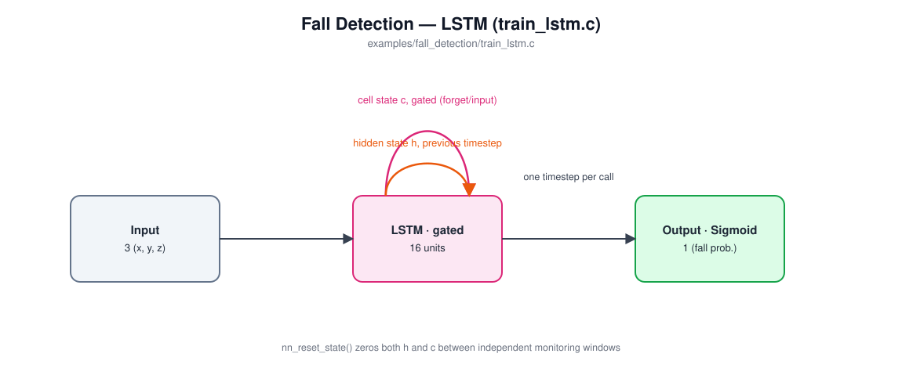

# Examples

Four self-contained examples of constructing, training, and evaluating a network with this library. Each has its own Makefile (`cd examples/<name> && make`, recursing into the top-level Makefile for the shared library), its own README (embedded-system framing, architecture diagram, build/run instructions, sample output), and generates, synthesizes, or downloads its own training data -- nothing here needs to be built from the repository root.

Read in order, they also tell a story: each example needs a little more memory (or a little more realism) than the last to solve its task, and the layer type -- or, for the last one, the extra feature-extraction stage in front of it -- tracks that escalation directly.

| Example | Layer type | Task | Parameters |
|---|---|---|---|
| [`character_recognition`](character_recognition/README.md) | CNN *vs.* plain FC (both included, for comparison) | Classify a whole 28×28 image at once -- no memory of anything needed | ~191K (CNN) / ~109K (FC) |
| [`gesture_recognition`](gesture_recognition/README.md) | RNN | Classify a short (32-timestep) burst of sensor readings -- needs to remember the last second or so | 388 |
| [`fall_detection`](fall_detection/README.md) | RNN *vs.* GRU *vs.* LSTM (all three included, for comparison) | Continuously monitor a long (150-timestep) stream and flag a rare event -- needs to remember something brief that happened many steps ago, selectively, without it decaying | 337 (RNN) / 977 (GRU) / 1,297 (LSTM) |
| [`wake_word_detection`](wake_word_detection/README.md) | GRU (the winner of a measured RNN *vs.* GRU *vs.* LSTM comparison -- see its README) | Classify a whole (49-frame) real spoken utterance as a wake word or not -- same fixed-window shape as `gesture_recognition`, but on real audio (via a new `audio_features.[ch]` feature-extraction stage) instead of a synthetic sensor stream | ~5,121 |

## [`character_recognition`](character_recognition/README.md)

 

Recognizes handwritten digits (MNIST) -- the "hello world" of embedded computer vision, and the network behind this library's own STM32H7 hardware demo (see the top-level README). Trains **two** architectures on identical data -- `train_cnn.c` (convolution + pooling ahead of the fully-connected layers) and `train_fc.c` (a plain FC network, no convolution at all) -- so the accuracy a CNN actually buys you over the baseline is something you can measure, not just take on faith. No recurrence involved: the whole image is seen at once.

## [`gesture_recognition`](gesture_recognition/README.md)

 

Classifies a short burst of simulated 3-axis accelerometer readings (STILL / SHAKE / TILT_LEFT / TILT_RIGHT) -- the shape of model behind gesture-based wake/control features on wearables and remote controls. A single instantaneous reading can't tell these apart; you need the shape of the motion over a couple dozen timesteps. `LAYER_TYPE_RNN` gives the network a hidden state that persists across calls, so it builds up a picture of the gesture one timestep at a time instead of needing the whole window handed to it at once.

## [`fall_detection`](fall_detection/README.md)

 

Continuously monitors a much longer simulated accelerometer stream for a fall -- a fall-detection pendant's actual job. A fall is a multi-phase pattern (free-fall dip, impact spike, then a long stretch of unusual stillness afterward), and confirming it's genuine means remembering the brief early dip across a long, quiet gap. Trains **three** architectures on identical data -- `train_rnn.c`, `train_gru.c`, `train_lstm.c` -- and measures them honestly rather than assuming gating wins: all three reach the same accuracy ceiling on this task, but the gated ones (GRU, LSTM) get there in reliably fewer training epochs. See this example's own README for the full epoch-count comparison.

## [`wake_word_detection`](wake_word_detection/README.md)

Classifies a whole ~1-second spoken utterance as a single wake word ("marvin") or not -- the always-on listener in front of a voice-controlled device. Structurally it's a fixed-window classifier like `gesture_recognition` (one label per whole window, not `fall_detection`'s per-timestep-varying one), but it's the first example built on a real, downloaded dataset (Google Speech Commands) instead of a synthetic generator, which means the model needs a real signal-processing stage -- a new `audio_features.[ch]` at the repository root (framing, FFT, mel filterbank, per-clip-normalized log energy) -- in front of a recurrent layer. An early version of this example compared the same three recurrent architectures `fall_detection` does; on this real, noisier task GRU won clearly (unlike `fall_detection`'s task, where all three tie), so `train.c` here trains GRU alone -- see this example's own README for the measured numbers, why normalization mattered more than architecture choice, and the library-vs-application split its `predict.c` illustrates.
