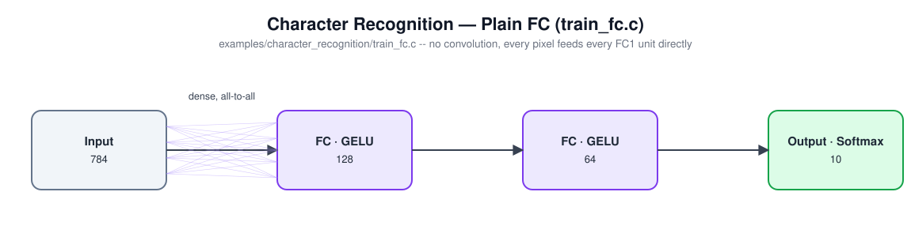

# Character Recognition

Trains a network to recognize handwritten digits (MNIST) -- two architectures on the same data, so you can see what the convolutional layers actually buy you.

## In an embedded system

Handwritten-digit recognition is the "hello world" of embedded computer vision, but it's not just a toy: the same shape of model is what runs behind a smart pen digitizing handwritten forms, a point-of-sale device reading a handwritten amount, a meter reader OCR-ing a dial, or a postal sorter reading a ZIP code -- anywhere a small, fixed-size image needs to become a class label on-device, without round-tripping to a server. This `nn` library's own hardware demo (see the top-level README) is exactly this: a handwritten-character recognizer running live on an STM32H7 microcontroller.

This example trains two different architectures on the identical data, so the tradeoff a real embedded project faces -- accuracy vs. compute/memory budget vs. how much of that budget the *shape* of the network costs you, not just its raw size -- is something you can actually see numbers for, rather than take on faith.

## Model architecture

### `train_cnn.c` -- convolution + pooling ahead of the fully-connected layers


| Layer | Type | Output shape | Notes |
|---|---|---|---|
| 0 | Input | 28×28×1 | one channel, raw pixel intensities |
| 1 | CNN | 28×28×8 | 5×5 kernel, 8 filters, stride 1, "same" padding (keeps the full 28×28 instead of shrinking to 24×24, so digit strokes near the border still get seen by every kernel position) |
| 2 | Pool | 14×14×8 | 2×2 max pool, stride 2 |
| 3 | FC | 120 | GELU |
| 4 | Dropout | 120 | 30%, training only |
| 5 | FC | 20 | GELU |
| 6 | Output | 10 | Softmax (cross-entropy loss) |

~191K trainable parameters -- and, worth noticing, the convolution itself contributes almost none of that (5×5×1×8 + 8 bias = 208 weights): the first FC layer (1568→120, after flattening the pooled 8×14×14 volume) is what actually dominates the parameter count. The convolution's job here isn't to be big, it's to turn a 784-pixel image into a much smaller, translation-invariant 1568-value summary before the expensive fully-connected layers ever see it.

### `train_fc.c` -- plain fully-connected network, no convolution



| Layer | Type | Output shape | Notes |
|---|---|---|---|
| 0 | Input | 784 | flattened 28×28 pixels, no spatial structure |
| 1 | FC | 128 | GELU |
| 2 | FC | 64 | GELU |
| 3 | Output | 10 | Softmax (cross-entropy loss) |

~109K trainable parameters -- fewer than the CNN, despite having no convolution/pooling at all, since every one of its FC layers is smaller. Every input pixel connects directly to every unit in the first FC layer: no shared weights, no spatial locality, no translation invariance. This is the baseline a CNN is normally justified against.

### How they compare

A real run of each (see [Sample output](#sample-output) below for the full logs):

| | Parameters | Epochs to converge | Test accuracy |
|---|---|---|---|
| `train_cnn` | ~191K | 9 | 97.91% |
| `train_fc` | ~109K | 8 | 96.13% |

Your numbers will vary run to run (random weight init, shuffled data), but expect the CNN to consistently edge out the FC network on this task -- the point of having both examples side by side.

## Build and run

```
cd examples/character_recognition
make
```
This also downloads the MNIST dataset (`samples.csv`, ~110MB, cached after the first run) and splits it into `train.csv`/`validation.csv`/`test.csv` via `split.py` (see the top-level README for that script's `--train`/`--validation` options).

Train the CNN:
```
./train_cnn model_cnn.txt
```
Train the plain FC network (use a different `<model-file>` than the CNN's -- a model built by one architecture can't be resumed by the other):
```
./train_fc model_fc.txt
```
Either can be resumed/fine-tuned by re-running the same command against an existing model file.

Evaluate either (the same `test.c` works for both, since it just reads whatever the model's input/output widths are):
```
./test model_cnn.txt
./test model_fc.txt
```

Run inference against a trained model:
```
./predict model_cnn.txt
```

## Sample output

Training log (`train_cnn`):
```
Creating new model.
train error, validation error, learning rate
0.25635, 0.10860, 0.00500
0.12537, 0.09495, 0.00500
0.09527, 0.07517, 0.00500
0.08012, 0.07398, 0.00500
0.07031, 0.07500, 0.00500
0.06244, 0.07426, 0.00500
0.05833, 0.08272, 0.00500
0.05352, 0.09144, 0.00500
0.05106, 0.08093, 0.00500
No validation improvement for 5 epochs (best: 0.07398) -- stopping early.
Final (last epoch) train error: 0.051060, validation error: 0.080931
Best validation error (the model saved to disk): 0.073982
Training epochs: 9
```

`test model_cnn.txt`:
```
Train: 55487/56000 = 99.08%
Test : 6854/7000 = 97.91%
```

`predict model_cnn.txt` (per-class probability for one sample digit):
```
0: 0.00041
1: 0.00057
2: 0.00153
3: 0.03929
4: 0.00002
5: 0.00931
6: 0.00072
7: 0.00137
8: 0.94517
9: 0.00160
```

Training log (`train_fc`):
```
Creating new model.
train error, validation error, learning rate
0.26005, 0.15315, 0.00500
0.10576, 0.12386, 0.00500
0.07074, 0.11354, 0.00500
0.04833, 0.11842, 0.00500
0.03595, 0.12634, 0.00500
0.02503, 0.11943, 0.00500
0.01891, 0.11780, 0.00500
0.01401, 0.11388, 0.00500
No validation improvement for 5 epochs (best: 0.11354) -- stopping early.
Final (last epoch) train error: 0.014007, validation error: 0.113876
Best validation error (the model saved to disk): 0.113543
Training epochs: 8
```

`test model_fc.txt`:
```
Train: 54932/56000 = 98.09%
Test : 6729/7000 = 96.13%
```
