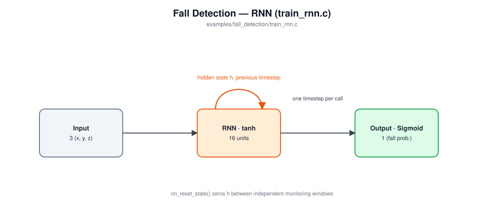
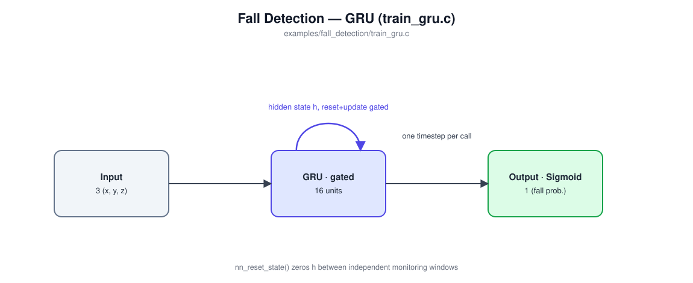

# Fall Detection

Trains a recurrent network to continuously monitor a simulated 3-axis accelerometer stream and flag a fall -- a multi-phase event (free-fall dip, impact spike, then a long stretch of post-fall stillness) spread across a much longer sequence than the gesture example's fixed windows, with a per-timestep label rather than one label for the whole window. No dataset to download -- every sequence is synthesized on the fly.

This example trains and compares **three** recurrent layer types on the identical task and data: `train_rnn.c` (plain RNN), `train_gru.c` (GRU), and `train_lstm.c` (LSTM). All three share `test.c` and `fall_data.[ch]`.

## In an embedded system

This is the model shape behind a real deployed product category: fall-detection pendants and smartwatch fall alerts for elderly or at-risk users. The device is always on, always watching a live accelerometer stream, and has to decide -- continuously, on-device, on a battery-powered microcontroller -- whether what just happened was a genuine fall worth raising an alarm for.

That "genuine" is the hard part. A fall isn't one instant, it's a *pattern over time*: a brief free-fall dip, then a sharp impact, then -- critically -- the person doesn't get up normally afterward. Confirming a real fall (and not, say, just setting the device down hard on a table) means remembering the free-fall dip once the impact arrives, and then continuing to watch for unusual stillness for a long stretch afterward.

## Why three architectures on the same task?

The gesture example makes the case for `LAYER_TYPE_RNN` over no memory at all. The natural next question is: doesn't a fall's long quiet gap between the dip and the "is it still down there" confirmation call for something more than a plain RNN's hidden state, which gets pushed back through a squashing nonlinearity every single timestep? Gated recurrent layers (GRU, LSTM) exist specifically to let a network hold a signal for a long stretch without it decaying.

Rather than assert that and move on, this example trains all three on the *exact same* synthetic data and reports what actually happens. Measured across several runs each:

| | Epochs to converge | Final per-timestep accuracy (held-out) |
|---|---|---|
| `train_rnn.c` | 60, 61, 90, 110, 203 | 97-100% |
| `train_gru.c` | 32, 41, 42, 46 | 97-100% |
| `train_lstm.c` | 9, 16, 33, 70 | 97-100% |

The honest finding: **all three reach essentially the same ceiling** on this task (100% fall recall, 0% false alarms, in every run) -- a plain RNN is not actually incapable of solving it. What gating buys you is *how fast and how reliably* the network finds that solution: LSTM typically converges in well under half the epochs an RNN needs, with GRU in between, at a lower per-timestep cost than LSTM. On a microcontroller that means fewer training passes over the same data (if training happens at all on-device) and a smaller, more predictable variance in how long training takes to converge -- not a difference in the ceiling you can eventually reach. Don't take either the "gating is unnecessary" or "gating is required" story here on faith -- run all three yourself (`make && ./train_rnn m1.txt && ./train_gru m2.txt && ./train_lstm m3.txt`) and look at the epoch counts printed at the end of each.

## Model architectures

All three share the same input/output shape and differ only in the recurrent layer's internals.

### RNN (`train_rnn.c`)



| Layer | Type | Output shape | Notes |
|---|---|---|---|
| 0 | Input | 3 | one accelerometer sample (x, y, z) per call |
| 1 | RNN | 16 | tanh activation; carries one persistent state (`h`) across calls |
| 2 | Output | 1 | Sigmoid -- fall probability at this timestep |

337 trainable parameters.

### GRU (`train_gru.c`)



| Layer | Type | Output shape | Notes |
|---|---|---|---|
| 0 | Input | 3 | one accelerometer sample (x, y, z) per call |
| 1 | GRU | 16 | fixed gate nonlinearities (sigmoid ×2, tanh); carries one persistent state (`h`), gated by a reset and an update gate (see `LAYER_TYPE_GRU`'s comment in `nn.h`) |
| 2 | Output | 1 | Sigmoid -- fall probability at this timestep |

977 trainable parameters -- about 3x the RNN's, since each of the three gates (reset, update, candidate) has its own weight row per hidden unit.

### LSTM (`train_lstm.c`)


| Layer | Type | Output shape | Notes |
|---|---|---|---|
| 0 | Input | 3 | one accelerometer sample (x, y, z) per call |
| 1 | LSTM | 16 | fixed gate nonlinearities (sigmoid ×3, tanh); carries **two** persistent states across calls -- the hidden state `h` (like RNN) and the cell state `c` (LSTM-specific, see `LAYER_TYPE_LSTM`'s comment in `nn.h`) |
| 2 | Output | 1 | Sigmoid -- fall probability at this timestep |

1,297 trainable parameters -- the most of the three (under 6KB as 32-bit floats), since each of the four gates (input, forget, cell-candidate, output) has its own weight row per hidden unit.

All three call `nn_train()`/`nn_predict()` once per timestep of a 150-sample monitoring window, with the label itself varying per timestep (0 throughout normal activity, flipping to 1 at the fall's onset and staying 1 through the end of the window) rather than one label for the whole window the way the gesture example does. `nn_reset_state()` is called before each new window (zeroing `h` for RNN/GRU, both `h` and `c` for LSTM).

## Build and run

```
cd examples/fall_detection
make
```

builds all three training programs (`train_rnn`, `train_gru`, `train_lstm`) plus the shared `test`.

Train whichever architecture you want to try (each synthesizes fresh training/validation sequences on the fly -- nothing to download; use a different model filename per architecture if you want to keep and compare all three):
```
./train_rnn model_rnn.txt
./train_gru model_gru.txt
./train_lstm model_lstm.txt
```

Evaluate any of them against a fresh, larger, independently-generated batch and print per-timestep accuracy, recall, false alarms, and detection latency:
```
./test model_rnn.txt
./test model_gru.txt
./test model_lstm.txt
```

## Sample output

Every run prints one example sequence of each kind (every 3rd timestep shown, condensed to acceleration magnitude + label) before training starts, so the free-fall dip and impact are visible. Excerpt of a FALL example around the onset (a normal sequence stays at label 0 and |a|≈1g throughout):
```
Sample FALL sequence (|accel| in g, every 3rd timestep):
  ...
  t= 87: |a|=1.04  label=0
  t= 90: |a|=0.02  label=1      <- free-fall: magnitude collapses toward 0
  t= 93: |a|=0.03  label=1
  t= 96: |a|=1.01  label=1      <- impact happened between t=93 and t=96 (not sampled at this stride)
  t= 99: |a|=1.00  label=1      <- post-fall stillness: label stays 1 for the rest of the window
  ...
```

`./train_rnn model_rnn.txt` (training log excerpt and final summary):
```
train error, validation error, learning rate
0.01115, 0.01052, 0.05000
0.00219, 0.01787, 0.05000
0.00179, 0.00033, 0.05000
...
0.00000, 0.00000, 0.05000
No validation improvement for 5 epochs (best: 0.00000) -- stopping early.
Final (last epoch) train error: 0.000008, validation error: 0.000004
Best validation error (the model saved to disk): 0.000003
Training epochs: 61
Per-timestep accuracy: 3000/3000 = 100.00%
Falls detected: 10/10
False alarms (normal sequences that ever triggered): 0/10
Average detection latency (timesteps after true onset): 0.0
```

`./train_gru model_gru.txt`:
```
train error, validation error, learning rate
0.00804, 0.01451, 0.05000
0.00380, 0.01723, 0.05000
0.00274, 0.01532, 0.05000
...
0.00003, 0.00002, 0.05000
No validation improvement for 5 epochs (best: 0.00001) -- stopping early.
Final (last epoch) train error: 0.000034, validation error: 0.000017
Best validation error (the model saved to disk): 0.000013
Training epochs: 41
Per-timestep accuracy: 3000/3000 = 100.00%
Falls detected: 10/10
False alarms (normal sequences that ever triggered): 0/10
Average detection latency (timesteps after true onset): 0.0
```

`./train_lstm model_lstm.txt`:
```
train error, validation error, learning rate
0.01927, 0.01491, 0.05000
0.00473, 0.02473, 0.05000
0.00399, 0.01624, 0.05000
...
0.00044, 0.01338, 0.05000
No validation improvement for 5 epochs (best: 0.01267) -- stopping early.
Final (last epoch) train error: 0.000438, validation error: 0.013376
Best validation error (the model saved to disk): 0.012668
Training epochs: 16
Per-timestep accuracy: 2918/3000 = 97.27%
Falls detected: 10/10
False alarms (normal sequences that ever triggered): 0/10
Average detection latency (timesteps after true onset): 0.0
```
(LSTM's early stop here landed on a slightly noisier local optimum than the other two in this particular run -- underscoring that "fewer epochs" isn't the same guarantee as "higher final accuracy"; see `./test` below, where all three still hit 100% fall recall with zero false alarms on fresh data.)

`./test` against a fresh, larger, independently-generated batch, for each of the three models trained above:
```
Test sequences: 50 normal, 50 fall (150 timesteps each, freshly synthesized)
```
| Model | Per-timestep accuracy | Falls detected (recall) | False alarms | Avg. detection latency |
|---|---|---|---|---|
| RNN | 15000/15000 = 100.00% | 50/50 = 100.0% | 0/50 = 0.0% | 0.0 |
| GRU | 14995/15000 = 99.97% | 50/50 = 100.0% | 0/50 = 0.0% | 0.0 |
| LSTM | 14903/15000 = 99.35% | 50/50 = 100.0% | 0/50 = 0.0% | 0.0 |
