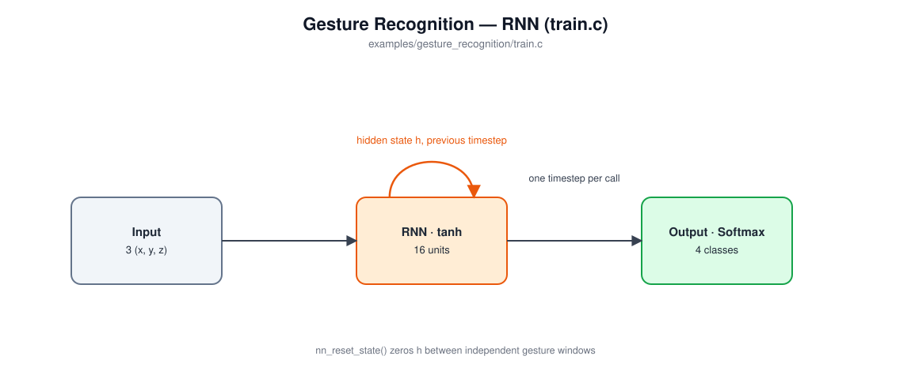

# Gesture Recognition

Trains a recurrent (RNN) network to classify a short burst of simulated 3-axis accelerometer readings into one of four gestures -- no dataset to download, every training window is synthesized on the fly.

## In an embedded system

This is the shape of model behind gesture-based wake/control features on wearables and remote controls: a smartwatch recognizing a "flick the wrist" gesture to wake the display, a TV remote mapping a shake or tilt to a command, a fitness band detecting a specific motion to start logging a rep. All of them share the same constraint -- a tiny, continuously-running classifier reading a live accelerometer stream on a microcontroller, not a server.

The reason this example uses an RNN rather than a plain FC network reading one accelerometer sample at a time: a single instantaneous reading can't tell SHAKE from STILL from TILT_LEFT -- you need the *shape of the motion over time*, not one instant of it. `LAYER_TYPE_RNN` gives the network a persistent hidden state that carries information across calls, so it can build up a picture of the gesture as timesteps arrive rather than only ever seeing one frame.

## Model architecture



| Layer | Type | Output shape | Notes |
|---|---|---|---|
| 0 | Input | 3 | one accelerometer sample (x, y, z) per call |
| 1 | RNN | 16 | tanh; hidden state persists across calls -- see `LAYER_TYPE_RNN`'s comment in `nn.h` |
| 2 | Output | 4 | Softmax over {STILL, SHAKE, TILT_LEFT, TILT_RIGHT} |

388 trainable parameters -- small enough that the whole model, uncompressed 32-bit floats, is under 2KB. `train.c` calls `nn_train()`/`nn_predict()` once per timestep of a 32-sample window (not once per whole window), and calls `nn_reset_state()` before each new window so one gesture's hidden state never leaks into the next. The recurrent connection is trained as truncated BPTT with a depth of 1 (see `LAYER_TYPE_RNN`'s comment in `nn.h`), which keeps memory flat regardless of how long a sequence runs -- important on a microcontroller, where "just store the whole sequence and back-propagate through all of it" isn't an option.

## Build and run

```
cd examples/gesture_recognition
make
```

Train (synthesizes fresh training/validation windows on the fly -- nothing to download):
```
./train gesture_model.txt
```

Evaluate against a fresh, independently-generated batch and print a confusion matrix:
```
./test gesture_model.txt
```

## Sample output

`train.c` first prints one example window per class (every timestep shown; excerpted here), so you can see what a STILL window looks like next to a SHAKE window before any training happens:
```
Sample gesture windows (accelerometer x, y, z per timestep):

STILL:
  t= 0:  0.018  0.026  1.015
  t= 1: -0.003 -0.048  0.944
  ...
  t=31:  0.001 -0.025  1.030

SHAKE:
  t= 0: -1.017 -0.482  0.999
  t= 1: -0.660  0.260  0.998
  ...
  t=31:  0.251 -0.683  1.035
```

Training log:
```
Creating new model.
train error, validation error, learning rate
0.36034, 2.35104, 0.05000
0.19004, 2.02392, 0.05000
0.12855, 2.10334, 0.05000
0.10883, 0.31510, 0.05000
...
0.07038, 0.10041, 0.05000
0.06890, 0.35477, 0.05000
0.07320, 0.09338, 0.05000
0.07298, 0.21956, 0.05000
No validation improvement for 5 epochs (best: 0.09272) -- stopping early.
Final (last epoch) train error: 0.072979, validation error: 0.219564
Best validation error (the model saved to disk): 0.092722
Validation accuracy (final-timestep classification): 32/32
Training epochs: 20
Gesture classes: 0=STILL, 1=SHAKE, 2=TILT_LEFT, 3=TILT_RIGHT
```

`test gesture_model.txt`:
```
Confusion matrix (rows = actual, columns = predicted), 50 windows per class:
            STILL       SHAKE       TILT_LEFT   TILT_RIGHT  
STILL       50          0           0           0             (50/50 = 100.0%)
SHAKE       0           50          0           0             (50/50 = 100.0%)
TILT_LEFT   0           0           50          0             (50/50 = 100.0%)
TILT_RIGHT  0           0           0           50            (50/50 = 100.0%)

Overall accuracy: 200/200 = 100.00%
```
