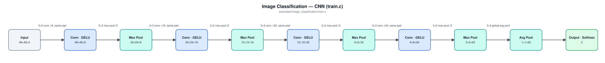

# Image Classification

Trains a CNN to tell a **cat** from a **dog** in a photo, using two public datasets together: Microsoft's [Kaggle Cats and Dogs](https://www.microsoft.com/en-us/download/details.aspx?id=54765) set (25,000 shelter photos from Petfinder.com, originally collected for the Asirra CAPTCHA; CDLA-Permissive 2.0) and the [Oxford-IIIT Pet dataset](https://www.robots.ox.ac.uk/~vgg/data/pets/) ([Parkhi, Vedaldi, Zisserman & Jawahar, 2012, "Cats and Dogs"](https://www.robots.ox.ac.uk/~vgg/publications/2012/parkhi12a/parkhi12a.pdf); ~7,400 photos of 37 breeds; CC BY-SA 4.0, with image copyright remaining with the original owners). Like [`character_recognition`](../character_recognition/README.md), it classifies one whole image at a time with stacked convolution + pooling layers. Unlike MNIST's centered digits on blank backgrounds, these are ordinary pet photos (on couches, lawns, and in people's arms), and the task is harder than it sounds. This README reports the numbers as measured.

## In an embedded system

Think of a camera-equipped pet door that lets the cat through but stays locked for the dog, or a feeder that only opens for the cat. A camera at the door or bowl wakes when something approaches and has to decide on the spot, on the device itself, with no cloud round-trip between the animal arriving and the latch deciding. It's the same reason [`wake_word_detection`](../wake_word_detection/README.md) runs its listener on-device.

The pieces map onto firmware the same way that example's do:

1. **Region of interest**: something has to say *where* in the frame the animal is. For Oxford photos that's a bounding box derived from the dataset's per-pixel animal outline (its "trimap"); Kaggle photos have no such annotation, so they use the whole frame. On a real device the box would come from a motion detector's changed-pixel bounding box, and it will be sloppier, which is why `prepare_data.c` trains on randomly shifted and rescaled crops, not just exact boxes. A camera mounted right at a pet door sees the animal fill most of the frame anyway, so `predict.c` defaults to the whole frame when no box is given.
2. **Preprocessing** (`image_prep.[ch]`): crop a square around that region, area-average it down to 48×48 RGB, and normalize it to zero mean and unit variance. No heap and no file I/O, so this is meant to ship into firmware next to `nn.c`/`nn.h`. Firmware has to run exactly what built the training data. This is the image counterpart of `audio_features.[ch]`.
3. **The classifier** (`train.c`): a ~25K-parameter CNN with a 2-way softmax output. Quantized to int8 it's 36,244 bytes of flash, and it needs ~338 KiB of RAM for activations at inference (see [Model architecture](#model-architecture)).

`predict.c` illustrates that split. Everything in it except decoding the image file is what firmware would do; a camera hands over raw pixels from its sensor driver.

## The datasets

`prepare_data.c` decodes the images with [`stb_image.h`](https://github.com/nothings/stb) (vendored in this directory; public domain / MIT; v2.30, commit `2c980bb`) and writes the CSVs below instead of reshuffling with `../../split.py`:

| File | Source | Cat images | Dog images |
|---|---|---|---|
| `train.csv` | Kaggle photos numbered 2–9 mod 10, plus Oxford `trainval.txt` minus every 10th image | 11,068 | 12,241 |
| `validation.csv` | Kaggle photos numbered 0 mod 10, plus every 10th Oxford `trainval.txt` image | 1,368 | 1,500 |
| `test.csv` | Kaggle photos numbered 1 mod 10 | 1,250 | 1,250 |
| `test_oxford.csv` | Oxford `test.txt` (the dataset's published test split) | 1,183 | 2,486 |
| `test_oxford_labels.txt` | one breed name per `test_oxford.csv` row, for `test.c`'s per-breed breakdown | | |

The Kaggle photos come numbered 0–12,499 per class with no meaningful order and no published split, so splitting by number is an arbitrary but fixed, reproducible split. About 230 of them are actually BMP, GIF, or PNG files under a `.jpg` name, which `stb_image` decodes fine. Three are skipped (two empty files and one Photoshop file).

The two test sets answer different questions:

- `test.csv` is balanced, so guessing scores **50%**. It measures how well the model handles more photos like most of what it trained on.
- `test_oxford.csv` has twice as many dogs as cats (25 dog breeds vs. 12 cat), so always answering "dog" scores **67.8%**. It's the same test set every earlier version of this example was measured on, so it shows directly what each change bought (see [More data](#more-data) and [More capacity](#more-capacity)), and its breed labels show *which* cats and dogs the model confuses.

Only `train.csv` is augmented. Every image becomes at least two rows, the crop and its mirror image, and each class is brought to ~20,000 rows. With the combined datasets nearly balanced, every image gets exactly those two rows. Beyond that, a class with fewer images would get extra randomly mirrored crops, shifted and rescaled by up to ±15% of the box size. The evaluation CSVs are not augmented. The augmentation uses a fixed random seed, so rerunning `prepare_data` reproduces the same `train.csv`.

## Model architecture



| Layer | Type | Output shape | Notes |
|---|---|---|---|
| 0 | Input | 48×48×3 | RGB, normalized per image |
| 1 | CNN | 48×48×8 | 5×5 kernel, 8 filters, "same" padding, GELU |
| 2 | Pool | 24×24×8 | 2×2 max pool, stride 2 |
| 3 | CNN | 24×24×16 | 3×3 kernel, 16 filters, "same" padding, GELU |
| 4 | Pool | 12×12×16 | 2×2 max pool, stride 2 |
| 5 | CNN | 12×12×32 | 3×3 kernel, 32 filters, "same" padding, GELU |
| 6 | Pool | 6×6×32 | 2×2 max pool, stride 2 |
| 7 | CNN | 6×6×64 | 3×3 kernel, 64 filters, "same" padding, GELU |
| 8 | Pool | 3×3×64 | 2×2 max pool, stride 2 |
| 9 | Pool | 1×1×64 | 3×3 average pool ("global average pooling"): one value per feature map |
| 10 | Output | 2 | Softmax (cross-entropy loss): cat, dog |

25,042 trainable parameters, all but 130 of them in the four conv layers. There's no fully-connected hidden layer: global average pooling reduces each of the 64 final feature maps to its average, so the output layer sees "how strongly each learned feature shows up anywhere in the crop" rather than a 576-wide map of where it showed up.

What it costs on a target:

- **Flash:** quantized to int8 and exported with `export --inplace`, the model is **36,244 bytes**. Quantization cost no measurable accuracy (86.28% / 84.11% on the two test sets vs. the float model's 86.36% / 84.22% below).
- **RAM:** a model loaded with `nn_load_model_inplace()` keeps its weights in flash but allocates two float buffers per layer (activations and pre-activations). For this network that's about **338 KiB**, plus the caller's 27 KiB input buffer. Most of it goes to the first two layers at full 48×48 resolution. That fits a 512 KiB-RAM microcontroller, but not a 256 KiB one. The [More capacity](#more-capacity) table lists smaller options.
- **Compute:** about 3.4 million multiply-adds per image.

## More data

An earlier version of this example trained on the Oxford-IIIT Pet dataset alone (3,312 training photos) with a smaller, 32×32 network. It tried 48×48 and 64×64 inputs, a 2× wider network, a fully-connected head with 6× the parameters, grayscale, and a higher learning rate. None moved test accuracy by more than a point. When a 6× range in parameter count and a 4× range in input pixels all land at the same accuracy, the limit is the data, not the model. So the next step was adding the 25,000 Kaggle photos (7× as many training photos), with that 32×32 architecture unchanged.

Averages over the runs listed. "Balanced" is the average of cat and dog recall, which doesn't reward leaning toward the majority class the way plain accuracy does:

| Training data (32×32 network) | Runs | `test.csv` (Kaggle) | `test_oxford.csv` | Oxford cat / dog recall | Oxford balanced |
|---|---|---|---|---|---|
| Oxford only (3,312 photos) | 5 | 64.2 (one model) | 73.9 (72.2–74.9) | 54.3 / 83.2 | 68.8 |
| Kaggle only (19,997 photos) | 3 | 78.4 (77.2–79.1) | 76.0 (75.1–76.8) | 68.8 / 79.5 | 74.2 |
| Kaggle + Oxford (23,309 photos) | 3 | 79.6 (79.3–80.2) | 78.1 (77.1–80.0) | 71.2 / 81.4 | 76.3 |

- **Accuracy on the same Oxford test set rose about 4 points**, and balanced accuracy about 7.5. Most of the gain was cats: the Oxford-only model caught barely half of them.
- **The Oxford-only model didn't generalize.** On the Kaggle photos it scored 64.2%, against ~79% for the models that trained on them. 3,312 photos taught it Oxford's photo style as much as it taught it cats and dogs.
- **Combining both datasets was best on both tests**, so that's what `prepare_data.c` builds by default.
- **Training overfit much less**, which suggested the model was no longer data-starved, and that capacity changes might now pay off where they hadn't before.

## More capacity

With 7× the data, the capacity changes were re-run on the combined datasets, plus one change that hadn't been tried on this dataset: a **GELU activation on the conv layers**. The earlier network's conv layers were linear, with max pooling as the only nonlinearity between them (as `../character_recognition/train_cnn.c` still is). The table gives averages over the runs listed. Cost columns are computed from each network's layer shapes: parameters, activation RAM at inference (two float buffers per layer, as above), and multiply-adds per image.

| Variant | Runs | `test.csv` (Kaggle) | `test_oxford.csv` | Oxford cat / dog | Params | RAM | MACs |
|---|---|---|---|---|---|---|---|
| 32×32, 3 stages, linear convs (previous) | 3 | 79.6 | 78.1 | 71.2 / 81.4 | 6.5K | 140 KiB | 1.2M |
| + 2× wider (16/32/64 channels) | 2 | 80.1 | 79.9 | 67.8 / 85.6 | 24K | 281 KiB | 3.6M |
| + 4th stage (deeper) | 2 | 79.9 | 79.2 | 72.7 / 82.3 | 25K | 151 KiB | 1.5M |
| + 48×48 input | 2 | 81.2 | 77.3 | 75.2 / 78.3 | 6.5K | 315 KiB | 2.7M |
| + 2× wider, 48×48 input | 2 | 83.1 | 80.7 | 74.5 / 83.5 | 24K | 631 KiB | 8.1M |
| **+ GELU** | **5** | **82.9** (81.3–84.5) | **81.1** (78.8–82.0) | 72.5 / 85.3 | **6.5K** | **140 KiB** | **1.2M** |
| + GELU, 4th stage | 5 | 82.8 (81.7–83.4) | 81.1 (80.3–82.8) | 75.3 / 83.9 | 25K | 151 KiB | 1.5M |
| + GELU, 2× wider | 2 | 84.7 | 83.0 | 75.3 / 86.7 | 24K | 281 KiB | 3.6M |
| + GELU, 48×48 input | 2 | 84.8 | 82.6 | 75.0 / 86.2 | 6.5K | 315 KiB | 2.7M |
| + GELU, 4th stage, 2× wider (16→128) | 2 | 84.6 | 83.3 | 72.8 / 88.3 | 98K | 301 KiB | 4.8M |
| **+ GELU, 4th stage, 48×48 (current)** | **5** | **86.2** (85.2–86.7) | **84.4** (83.9–84.9) | **74.8 / 89.0** | **25K** | **338 KiB** | **3.4M** |
| + GELU, 4th stage, 64×64 | 2 | 87.2 | 85.7 | 76.9 / 90.0 | 25K | 601 KiB | 6.0M |
| + GELU, 4th stage, 2× wider, 48×48 | 2 | 88.1 | 86.1 | 83.2 / 87.5 | 98K | 676 KiB | 10.7M |

What it showed:

- **GELU on the conv layers was the single biggest win, and it was free.** It added about 3 points on both test sets (+3.3 Kaggle, +3.0 Oxford) with no change in parameters, RAM, or compute.
- **GELU is what made more capacity pay off.** Without it, a wider network, a deeper one, or a larger input moved accuracy by between −0.8 and +3.5 points, inconsistently across the two test sets. With it, 2× width or a 48×48 input each added another ~1.5–2 points on both, and the gains stack.
- **The extra stage only helps alongside more resolution.** At 32×32, "GELU + 4th stage" tied plain GELU (82.9% / 81.1% each, five runs). At 48×48 the extra stage is part of the best configuration that fits in ~340 KiB.
- **Accuracy hasn't plateaued.** 64×64 input or a 2× wider network at 48×48 still gained another 1–2 points (two runs each), but needs ~600–680 KiB of RAM, roughly double. The current configuration is the best one measured that fits a 512 KiB-RAM part. If your target has 1 MiB, the wider 48×48 network is the most accurate option measured, and the only one that catches more than 80% of cats.

To use one of the other configurations, change `IMG_SIZE` in `image_prep.h` (it must stay a multiple of 16) or the channel counts in `train.c`, then rerun `make` (which rebuilds the CSVs) and train a fresh model.

## How good is it?

Better, but still not a finished product. Five runs of the final code scored **85.2–86.7%** (average 86.2%) on the balanced Kaggle test (guessing: 50%) and **83.9–84.9%** (average 84.4%) on the Oxford test (always-"dog": 67.8%). Training isn't seeded, so your run will land somewhere in those ranges. That's about +6 points on both test sets over the previous version, and +10.5 on Oxford over the original Oxford-only model. Roughly one photo in seven is still misclassified. On Oxford the model still leans toward "dog" (75% of cats caught vs. 89% of dogs); on the balanced Kaggle test it's nearly even (85% / 87%).

In the sample run's per-breed table (see [Sample output](#sample-output)), the hardest breeds are the plausible ones:

- **Unusual-looking cats:** hairless Sphynx is still the hardest (51%), then Bengal with its leopard-like spots and slender Egyptian Mau (71–73%).
- **Small or fluffy dogs:** Scottish Terrier (63%), Japanese Chin (71%), Keeshond (77%).
- **Easiest:** large hounds and spaniels such as Basset Hound (98%), Saint Bernard and English Cocker Spaniel (97%).

Confidence is much higher, too. On the same 15-image whole-frame spot check used for every earlier version, it got 14 right, most at 90–99.99% confidence. Both of the previous version's misses (an Abyssinian cat and a pit bull) are now correct. The one miss was a Samoyed, a fluffy white dog, called a cat at 68%.

The levers, if you're adapting this example:

- **More capacity, if your RAM allows.** See the bottom rows of the [More capacity](#more-capacity) table: accuracy was still rising with input size and width where this stopped.
- **Box quality.** The Oxford training crops come from careful per-pixel outlines, and the Kaggle photos use the whole frame. A real motion detector's boxes will be somewhere in between, so measure with your own detector in the loop before trusting these numbers.
- **Decision threshold.** `test.c` and `predict.c` pick whichever class scores higher. A pet door that errs toward keeping the dog out could require a higher cat score before opening, trading missed cats for fewer false openings. This wasn't measured here.

## Build and run

```
cd examples/image_classification
make
```

The first `make` downloads both datasets and extracts them into `dataset/`: Kaggle Cats and Dogs (~790MB zip from Microsoft's download center, which was fast when measured) and Oxford-IIIT Pet (~790MB of images and ~19MB of annotations from Oxford's own host, which is slow: about 250 KB/s per connection when this was written, so about half an hour). It then builds `prepare_data` and runs it to produce the CSVs (a couple of minutes; `train.csv` is ~2.4GB at 48×48), and builds `train`/`test`/`predict`. `make clean` keeps the downloads; `make distclean` removes them too.

`prepare_data.c`'s `OXFORD_TRAIN` setting controls whether Oxford's training images go into `train.csv`/`validation.csv` (the default) or only its test split is used, as in the "Kaggle only" row of the [More data](#more-data) table. Oxford is downloaded either way, since `test_oxford.csv` needs it.

Train the model. It's slow: ~46,000 training rows at 48×48, about 20 epochs. The five runs measured here took 1.5–2 hours each, though each was sharing the machine with 10–17 other training runs, so a run on its own should be faster.
```
./train model.txt
```
Re-running the same command against an existing model file resumes training from it.

Evaluate against both held-out test sets (confusion matrices, per-class and overall accuracy, and accuracy per Oxford breed):
```
./test model.txt
```

Classify one image (JPEG, PNG, BMP, or GIF). Optionally pass a box around the animal as `x y width height` in the image's pixel coordinates; without one, the whole frame's center square is used:
```
./predict model.txt dataset/images/British_Shorthair_97.jpg
```

## Sample output

Training log (`train`):
```
Creating new model.
train error, validation error, learning rate
0.62633, 0.56241, 0.00100
0.55854, 0.51587, 0.00100
0.51216, 0.48549, 0.00100
0.47403, 0.44378, 0.00100
0.44341, 0.41739, 0.00100
0.41864, 0.41712, 0.00100
0.39564, 0.37927, 0.00100
0.37651, 0.36542, 0.00100
0.35843, 0.36972, 0.00100
0.34314, 0.39865, 0.00100
0.32828, 0.34417, 0.00100
0.31244, 0.32730, 0.00100
0.30148, 0.34626, 0.00100
0.28957, 0.33260, 0.00100
0.27856, 0.32466, 0.00100
0.26898, 0.31379, 0.00100
0.26042, 0.32751, 0.00100
0.24868, 0.31187, 0.00100
0.24105, 0.32590, 0.00100
0.23193, 0.32259, 0.00100
0.22454, 0.32146, 0.00100
0.21519, 0.33553, 0.00100
0.20847, 0.40704, 0.00100
No validation improvement for 5 epochs (best: 0.31187) -- stopping early.
Final (last epoch) train error: 0.208470, validation error: 0.407035
Best validation error (the model saved to disk): 0.311868
Training epochs: 23
```

`test model.txt` (per-breed table abridged to the five worst and five best):
```
test.csv (held-out Kaggle Cats and Dogs photos):
          cat       dog
cat       1090      160         (1090/1250 = 87.2%)
dog       181       1069        (1069/1250 = 85.5%)
Overall accuracy: 2159/2500 = 86.36%

test_oxford.csv (Oxford-IIIT Pet test split):
          cat       dog
cat       914       269         (914/1183 = 77.3%)
dog       310       2176        (2176/2486 = 87.5%)
Overall accuracy: 3090/3669 = 84.22%

Accuracy by breed (worst first):
  Sphynx                       cat   51/100 =  51.0%
  scottish_terrier             dog   62/ 99 =  62.6%
  Bengal                       cat   71/100 =  71.0%
  japanese_chin                dog   71/100 =  71.0%
  Egyptian_Mau                 cat   71/ 97 =  73.2%
  ...
  english_setter               dog   96/100 =  96.0%
  english_cocker_spaniel       dog   97/100 =  97.0%
  saint_bernard                dog   97/100 =  97.0%
  basset_hound                 dog   98/100 =  98.0%
```

`predict` on a cat and a dog from the Oxford test split, whole frame:
```
$ ./predict model.txt dataset/images/British_Shorthair_97.jpg
cat: 0.99991
dog: 0.00009
Prediction: cat
$ ./predict model.txt dataset/images/japanese_chin_40.jpg
cat: 0.10728
dog: 0.89272
Prediction: dog
```
