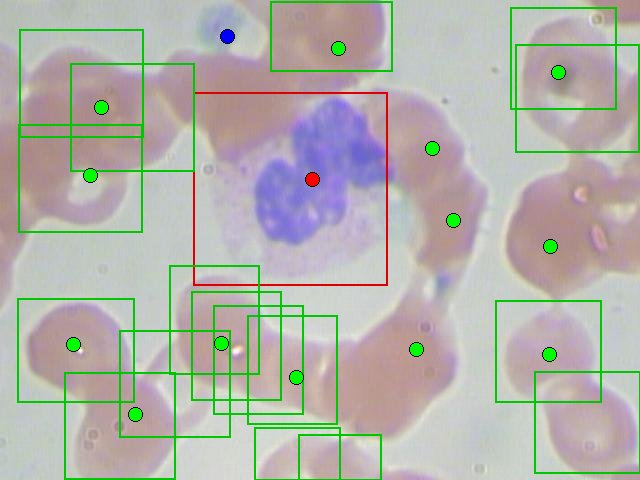

# Object Detection

Finds and counts the **red blood cells**, **white blood cells**, and **platelets** in a microscope photo of a stained blood smear, using the [BCCD (Blood Cell Count and Detection) dataset](https://github.com/Shenggan/BCCD_Dataset) (364 photos with a labeled box around each cell; MIT license). Every other example here gives one answer per input: a digit, a gesture, cat or dog. This one says *what* is in the frame, *where*, and *how many*, which is what object detection means. A blood count is a counting problem, so this is a natural first detector. This README reports the numbers as measured, including where the dataset's own labels limit what the numbers can show.

## In an embedded system

Think of a handheld blood analyzer, or a microscope camera clipped onto a phone, at a rural clinic or a field hospital. A complete blood count is, at its core, counting: how many red cells, white cells, and platelets are in a known volume of blood. Doing it on the device means a result in seconds with no lab and no network connection, and a patient's blood photo that never leaves the device.

The pieces map onto firmware the same way [`image_classification`](../image_classification/README.md)'s do:

1. **Preprocessing** (`image_prep.[ch]`): area-average the whole 640×480 camera frame down to 64×48 RGB and normalize each color channel to zero mean and unit variance. Unlike `image_classification`, there's no crop: a detector has to look at the whole frame. No heap and no file I/O, so this ships into firmware next to `nn.c`/`nn.h`.
2. **The detector** (`train.c`): a ~16K-parameter fully convolutional network whose output is one 16×12 *heatmap* per class (see [How detection works here](#how-detection-works-here)). Quantized to int8 it's 23,156 bytes of flash, and it needs ~269 KiB of RAM for activations.
3. **Decoding** (`heatmap.[ch]`): turn the three heatmaps into a list of detections (class, position, score) by finding their peaks. This is the step between `nn_predict()` and "13 red cells, 1 white cell, 1 platelet", so it ships into firmware too.

`predict.c` illustrates that split. Everything in it except decoding the image file is what firmware would do.

## The dataset

`prepare_data.c` decodes the photos with [`stb_image.h`](https://github.com/nothings/stb) (vendored at the repository root and shared with `image_classification`), reads each photo's Pascal VOC XML annotation, and keeps BCCD's published train/val/test split. The Makefile downloads a pinned commit of the dataset (~8MB).

| File | Source | Photos | RBC | WBC | Platelets |
|---|---|---|---|---|---|
| `train.csv` | `ImageSets/Main/train.txt`, ×32 augmented rows per photo | 205 | 2,381 | 214 | 209 |
| `validation.csv` + `validation_boxes.txt` | `ImageSets/Main/val.txt` | 87 | 967 | 87 | 83 |
| `test.csv` + `test_boxes.txt` | `ImageSets/Main/test.txt` | 72 | 805 | 71 | 69 |

A typical photo has a dozen red cells, almost always exactly one white cell, and zero to a few platelets. They're very different sizes: in the 640×480 photos a median white cell is ~190 pixels across, a red cell ~100, and a platelet ~40.

The `*_boxes.txt` files carry each photo's labeled boxes in its original pixel coordinates. `test.c` scores detections against those boxes rather than against the heatmap targets.

**Augmentation.** 205 training photos is very little, so `train.csv` has 32 rows per photo. A blood smear has no "up", so the photo and its three mirror images (left-right, top-bottom, and both, which is a 180° rotation) are equally valid. Every row after those four is randomly mirrored, shifted by up to ±10% of the frame, and rescaled by up to ±10%. (A 90° rotation would be just as valid, but would turn the 4:3 frame into a 3:4 one.) Color jitter isn't needed: the per-channel normalization already removes a frame's overall color cast, which is most of what differs between slides and microscopes. The augmentation uses a fixed random seed, so rerunning `prepare_data` reproduces the same `train.csv`.

**The labels are incomplete.** Many BCCD photos have red cells with no box; a few have no red-cell boxes at all, and some white cells have no WBC box. A model that finds those cells gets marked down for it, which limits what any score against these labels can show. [Results](#results) quantifies how much.

## How detection works here

Detectors like YOLO and SSD predict, for every grid cell, an "is there an object" score, four box coordinates, and a per-cell class softmax, trained with a different loss for each part and a mask so cells with no object don't train box coordinates. This library's `nn_train()` has one loss for the whole output layer: cross-entropy for a softmax output, MSE for anything else. So instead this example uses the simpler formulation small embedded detectors (such as Edge Impulse's FOMO) use: **predict object centers, not boxes**.

- The network's output is one heatmap per class on a coarse 16×12 grid, each cell covering a 40×40-pixel patch of the original photo. A cell's value is the network's confidence that an object of that class is *centered* in it.
- The training target for each object is 1 at the cell containing its center, falling off as a Gaussian (σ = 0.7 cells) over the neighboring cells. Everywhere else it's 0. Every output has a target, so plain MSE trains it with no masking.
- At inference, `heatmap_decode()` reports every cell that's above a threshold and a local maximum among its 8 neighbors as one detection, positioned at the value-weighted center of that 3×3 neighborhood. The count for a class is the number of its detections.

The trade-off is that there are no boxes, just centers, and two objects of the same class whose centers fall in the same cell count as one. For blood cells neither matters much. A count doesn't need boxes, and at 16×12, 99.5% of the labeled objects in the validation and test sets have a cell to themselves. (At 8×6 it would be 96.7%.)

**No library changes were needed.** The network's last layer is a `LAYER_TYPE_CNN` with a 1×1 kernel and a sigmoid, not a `LAYER_TYPE_OUTPUT`: `nn_train()` computes the loss on whatever the final layer is. A 1×1 convolution applies the same small classifier at every grid cell, and its CHW output is exactly the heatmap layout. A fully-connected output layer in its place would need 3.5 million weights to connect every feature to every output. The 1×1 conv needs 99.

## Model architecture


| Layer | Type | Output shape | Notes |
|---|---|---|---|
| 0 | Input | 64×48×3 | RGB, normalized per channel |
| 1 | CNN | 32×24×8 | 5×5 kernel, stride 2, GELU |
| 2 | CNN | 32×24×16 | 3×3 kernel, "same" padding, GELU |
| 3 | Pool | 16×12×16 | 2×2 max pool, stride 2 |
| 4 | CNN | 16×12×32 | 3×3 kernel, "same" padding, GELU |
| 5 | CNN | 16×12×32 | 3×3 kernel, "same" padding, GELU |
| 6 | CNN | 16×12×3 | 1×1 kernel, sigmoid (MSE loss): RBC, WBC, platelet heatmaps |

15,763 trainable parameters. Layers 4 and 5 run at the output grid's resolution with no pooling, so neighboring cells stay distinct, and they widen what each output cell sees to 27×27 input pixels (a white cell is ~20 across at this scale). The first layer uses a stride of 2 instead of a stride-1 convolution followed by pooling; see [What else was tried](#what-else-was-tried).

What it costs on a target:

- **Flash:** quantized to int8 and exported with `export --inplace`, the model is **23,156 bytes**. Quantization cost no measurable accuracy (one fewer platelet detected on the test set, below).
- **RAM:** a model loaded with `nn_load_model_inplace()` keeps its weights in flash but allocates two float buffers per layer. For this network that's about **269 KiB**, plus the caller's 36 KiB input buffer. That fits a 512 KiB-RAM microcontroller. For a 256 KiB one, the half-width variant in [What else was tried](#what-else-was-tried) needs 137 KiB and loses a point or two.
- **Compute:** about 4.0 million multiply-adds per photo.

## Results

Scored on BCCD's 72-photo test split at the 0.4 threshold, averaged over five independently trained models (range in parentheses). A detection is a hit if its center falls inside a labeled box of the same class (see `test.c`). "Count MAE" is the mean absolute difference, per photo, between the number of detections and the number of labeled objects.

| Class | Precision | Recall | F1 | Count MAE per photo | Total count (labeled) |
|---|---|---|---|---|---|
| Red blood cells | 77.2% (76.0–78.4) | 77.3% (74.0–78.9) | **77.2%** (76.2–78.1) | 2.82 (of ~11 per photo) | 807 (805) |
| White blood cells | 94.7% (all five) | 100% (all five) | **97.3%** (all five) | 0.06 | 75 (71) |
| Platelets | 76.5% (75.0–79.0) | 69.0% (60.9–73.9) | **72.5%** (67.2–75.2) | 0.44 | 62 (69) |

What those numbers mean depends heavily on the labels, so class by class:

- **White cells: in fact every one found, with no false alarms.** All five models found every one of the 71 labeled white cells, and all five made the same 4 "false positive" detections. All 4 are real white cells the labels miss: in `BloodImage_00135` the white cell is boxed as a platelet, and in `00171`, `00178`, and `00327` it has no box at all. Against what is actually in the photos, every model found all 75 white cells and nothing else.
- **Red cells: right in total, ±3 per photo, partly because of the labels.** Over the whole test set the count is unbiased (807 detected vs. 805 labeled), but a single photo's count is off by ~2.8 cells out of ~11. Part of that is the labels. Three test photos (`00249`, `00303`, `00327`) have no red-cell boxes at all, though each is full of red cells, so every detection in them (35, for one of the five models) counts as a false positive. Leaving out just those three photos raises that model's red-cell precision from 76.9% to 80.4%. Other photos have scattered unlabeled cells too: four of the thirteen red-cell detections in the sample below are real cells with no box. The misses are the model's own: they concentrate in clumps of overlapping cells, which at 64×48 often merge into one blob with one peak.
- **Platelets: the hardest class, and the noisiest number.** A platelet is ~4 pixels across at the network's 64×48 input, and the model undercounts them by ~10% (62 vs. 69). F1 also varies most between runs (67–75%). With only 69 platelets in the test set, each one is worth 1.4 points of recall.



*`BloodImage_00007` from the test set: boxes are the dataset's labels, dots are one model's detections (green: red cell, red: white cell, blue: platelet). The four red-cell dots with no box around them, right of center, are real cells the labels miss. Photo from the BCCD dataset (MIT license).*

## What mattered: soft targets

The single change that made this work was the training target. The first version marked only the one cell containing each object's center (1 there, 0 everywhere else). Validation F1 per class (RBC / WBC / platelet):

| Heatmap target | Optimizer | Validation F1 |
|---|---|---|
| 1 at the center cell only | SGD, learning rate 0.001 | 76.8 / **0** / **0** after 10 epochs |
| 1 at the center cell only | Adam, 0.001 | 0 / 0 / 0: collapsed to predicting nothing anywhere |
| 1 at the center cell only | SGD, 0.005 | 0 / 0 / 0: collapsed the same way |
| Gaussian, σ = 0.7 cells | SGD, 0.001 | 77.9 / 99.4 / 73.9 after 7 epochs |

With one-cell targets, a white cell is 1 positive cell out of 192 in its heatmap, and a photo has one white cell. The cheapest way to drive MSE down is to predict ~0 everywhere, which is exactly what the network learned for white cells and platelets, and, with a larger step size, for red cells too (validation error froze at the value an all-zero output gets). Spreading each target over its neighbors gives every object several cells of positive signal instead of one, and stops penalizing a prediction that's one cell off as harshly as one that's nowhere near. `heatmap_decode()`'s local-maximum step turns each blob back into one detection.

## What else was tried

Once the targets were fixed, nothing else tried moved the results beyond run-to-run noise. The table gives validation F1 (the set these choices were made on) and test F1, per class (RBC / WBC / platelet). Cost columns are computed from each network's layer shapes: parameters, activation RAM at inference (two float buffers per layer, as above), and multiply-adds per photo.

| Variant | Runs | Validation F1 | Test F1 | Params | RAM | MACs |
|---|---|---|---|---|---|---|
| 3×3 conv + 2×2 pool first stage, σ = 0.7 | 3 | 78.2 / 99.4 / 74.1 | 77.6 / 97.1 / 71.8 | 15.4K | 461 KiB | 4.2M |
| &nbsp;&nbsp;σ = 0.5 | 1 | 76.7 / 98.9 / 68.2 | 75.8 / 95.8 / 79.1 | 15.4K | 461 KiB | 4.2M |
| &nbsp;&nbsp;σ = 1.0 | 1 | 77.4 / 99.4 / 75.4 | 77.4 / 97.3 / 68.8 | 15.4K | 461 KiB | 4.2M |
| &nbsp;&nbsp;σ = 0.7, Adam | 1 | 78.3 / 99.4 / 74.1 | 76.5 / 97.3 / 72.2 | 15.4K | 461 KiB | 4.2M |
| &nbsp;&nbsp;σ = 1.0, Adam | 1 | 77.5 / 99.4 / 73.2 | 77.9 / 97.3 / 72.1 | 15.4K | 461 KiB | 4.2M |
| &nbsp;&nbsp;2× wider (16/32/64/64 channels) | 1 | 79.0 / 99.4 / 76.5 | 77.0 / 97.3 / 76.1 | 60.7K | 917 KiB | 15.5M |
| **5×5 stride-2 first layer (`train.c`)** | **5** | **78.1 / 99.4 / 74.5** | **77.2 / 97.3 / 72.5** | **15.8K** | **269 KiB** | **4.0M** |
| &nbsp;&nbsp;half width (4/8/16/16 channels) | 1 | 77.3 / 98.9 / 70.2 | 76.6 / 97.3 / 67.2 | 4.1K | 137 KiB | 1.1M |

- **The stride-2 first layer** went straight from the 64×48 frame to 32×24, instead of holding a full-resolution 64×48×8 map and then pooling it. That cut activation RAM by 42% at the same accuracy, so `train.c` uses it.
- **σ, Adam, and 4× the parameters** made no consistent difference. No variant is better on both sets: σ = 0.5 has the best test platelet F1 of any run (79.1%) and the worst validation platelet F1 (68.2%). The five stride-2 runs alone, identical except for their random seed, span 67–75% test platelet F1. Adam converged in fewer epochs (12–15 vs. 16–30) but no better, and it costs two extra floats per weight during training, which matters for a model meant to keep training on the device, so `train.c` keeps plain SGD.
- **The half-width network** is the option for a 256 KiB-RAM part: 137 KiB of activations and 6,300 bytes of int8 weights, for a point or two of red-cell F1 and a few points of platelet F1 (from one run).

When a 4× range in parameters lands at the same accuracy, the limit is the data, not the model. This is the same conclusion [`image_classification`](../image_classification/README.md#more-data) reached before it added more photos. Here the limit is 205 training photos and labels that miss cells, and the obvious next step is better labels, not a bigger network.

## Build and run

The first `make` downloads the dataset and builds the CSVs:

```
cd examples/object_detection
make
./train model.txt
./test model.txt
./predict model.txt dataset/BCCD/JPEGImages/BloodImage_00007.jpg
```

`test.c` first sweeps the peak threshold on `validation.csv` and prints each class's F1 at each, then scores `test.csv` once at `HEATMAP_THRESHOLD` (0.4, chosen from that sweep; see `heatmap.h`). Pass a second argument to score the test set at a different threshold instead. `predict` takes an optional third argument for the same.

To build the flash-resident int8 model measured above:

```
../../quantize model.txt model_q.txt
../../export model_q.txt model.inplace --inplace
./test model.inplace
```

## Sample output

`./test model.txt` for one of the five models above:

```
Threshold sweep on validation.csv (87 photos), F1 per class:
threshold        RBC       WBC  platelet
0.1            74.5%     99.4%     69.7%
0.2            76.4%     99.4%     75.8%
0.3            78.2%     99.4%     77.0%
0.4            78.6%     99.4%     78.8%
0.5            77.6%     98.3%     77.4%
0.6            74.0%     97.7%     74.5%
0.7            68.1%     92.7%     75.6%
0.8            57.0%     78.6%     69.0%
0.9            35.1%     38.9%     36.9%

test.csv (72 photos, BCCD's published test split), threshold 0.40:
class      precision    recall        F1  count MAE count (vs. labeled)
RBC            76.9%     78.4%     77.6%       2.81      821 (805)
WBC            94.7%    100.0%     97.3%       0.06       75 (71)
platelet       75.0%     73.9%     74.5%       0.40       68 (69)
```

`./predict model.txt dataset/BCCD/JPEGImages/BloodImage_00007.jpg`, the photo shown in [Results](#results). The grid at the bottom is the network's 16×12 output grid, with the class detected in each cell (R, W, or P):

```
RBC: 13
WBC: 1
platelet: 1

RBC       at ( 338,   48)  score 0.66
RBC       at ( 558,   72)  score 0.52
RBC       at ( 101,  107)  score 0.44
RBC       at ( 432,  148)  score 0.40
RBC       at (  90,  175)  score 0.62
RBC       at ( 453,  220)  score 0.42
RBC       at ( 550,  246)  score 0.57
RBC       at (  73,  344)  score 0.94
RBC       at ( 221,  343)  score 0.83
RBC       at ( 416,  349)  score 0.70
RBC       at ( 549,  354)  score 0.92
RBC       at ( 296,  377)  score 0.52
RBC       at ( 135,  414)  score 0.42
WBC       at ( 312,  179)  score 0.68
platelet  at ( 227,   36)  score 0.75

. . . . . P . . . . . . . . . .
. . . . . . . . R . . . . R . .
. . R . . . . . . . . . . . . .
. . . . . . . . . . R . . . . .
. . R . . . . W . . . . . . . .
. . . . . . . . . . . R . . . .
. . . . . . . . . . . . . R . .
. . . . . . . . . . . . . . . .
. R . . . R . . . . R . . R . .
. . . . . . . R . . . . . . . .
. . . R . . . . . . . . . . . .
. . . . . . . . . . . . . . . .
```

Training one model took 14–24 minutes here, on one desktop CPU core (training is single-threaded, one sample at a time, like every example here).
